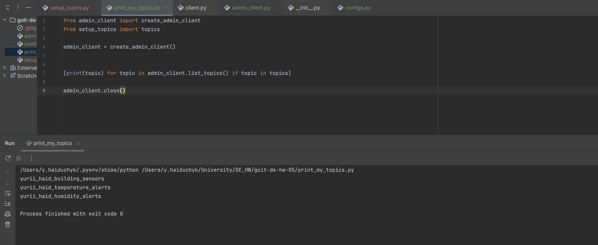
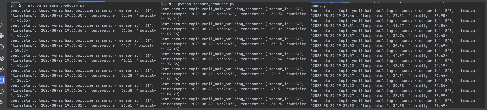
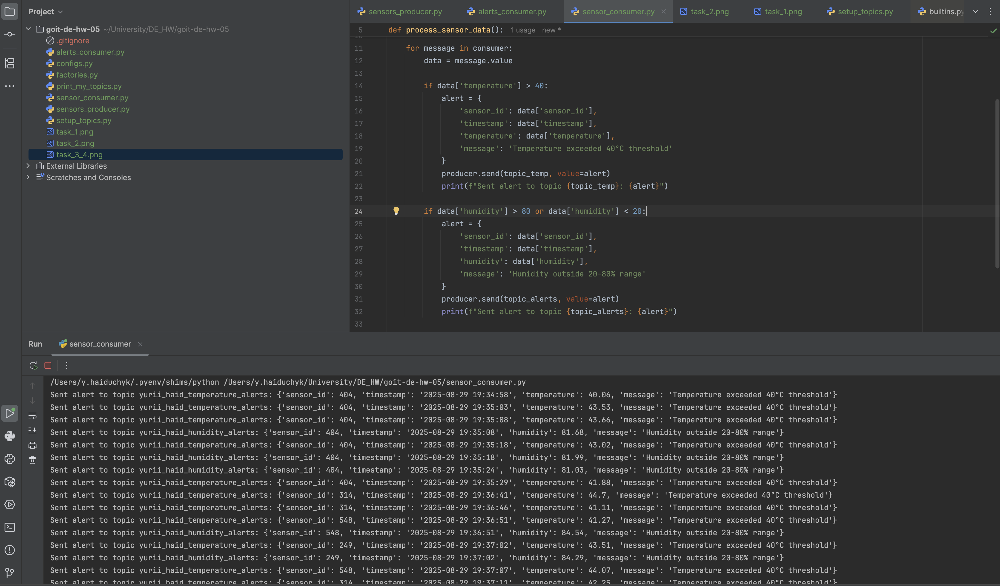
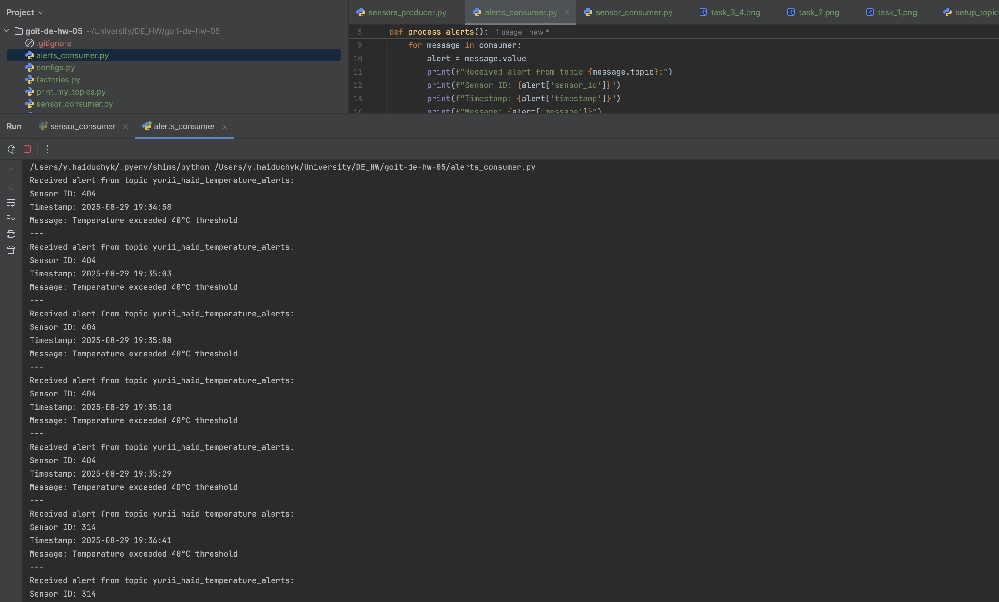

# Звіт про виконання завдання

## Етап 1: Створення топіків
Скрипт `setup_topics.py` створює три топіки:  
- `yurii_haid_building_sensors`  
- `yurii_haid_temperature_alerts`  
- `yurii_haid_humidity_alerts`  

---

## Етап 2: Генерація даних сенсорів
Скрипт `sensors_producer.py` генерує випадкові дані про температуру та вологість і передає їх до топіка `yurii_haid_building_sensors`.

---

## Етапи 3,4: Фільтрація даних та відправка алертів
Скрипт `sensor_consumer.py` споживає дані з топіка `yurii_haid_building_sensors`, перевіряє граничні значення температури (>40°C) і вологості (<20% або >80%), а потім відправляє відфільтровані дані до відповідних топіків.

## Етап 5: Отримання фільтрованих даних
Скрипт `alerts_consumer.py` отримує повідомлення з топіків `yurii_haid_temperature_alerts` і `yurii_haid_humidity_alerts`, а потім відображає інформацію про сповіщення на екрані.

**Скріншот:**  

